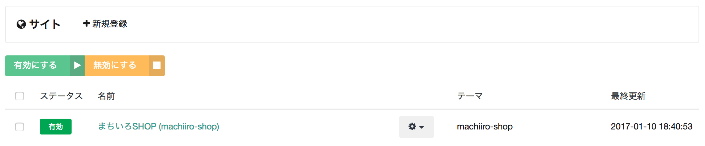

# サイト

machi-lia のサイトを管理します。

## テーマ

machi-lia では、サイトを構成する HTML/CSS/JS/ERB といったファイル群をテーマ、またはテーマリポジトリと呼びます。
ここで選択したいテーマのリポジトリは、machi-lia インスタンス上にに事前にデプロイされている必要があります。

## テーマで使用するマスタの投入について

「マスタを自動的に登録する」にチェックを付けて保存すると、テーマリポジトリに定義されているマスタが自動投入されます。 
ただし、同一コードのマスタが既に存在する場合は投入されません。これは本番環境で誤って古い初期データを投入してしまう事故を防ぐためです。
