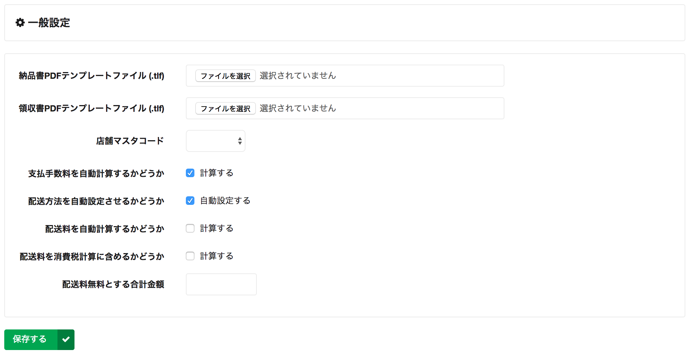

# 一般設定

EC に関する設定を行います。

## 納品書/領収書 PDF テンプレートファイル

machi-lia では PDF 生成に [ThinReports](http://www.thinreports.org/) というライブラリを利用しています。

ThinReports では、PDF デザイン用に Google Chrome アプリが提供されています。
こちらを利用して tlf ファイルを生成し、本画面からアップロードすることで自由に PDF レイアウトを変更することが可能です。

## 店舗マスタコード

注文データが持つ店舗項目で実際に店舗情報を格納するためには、予め店舗情報をマスタ化しておきこの画面から当該マスタを選択する必要があります。
