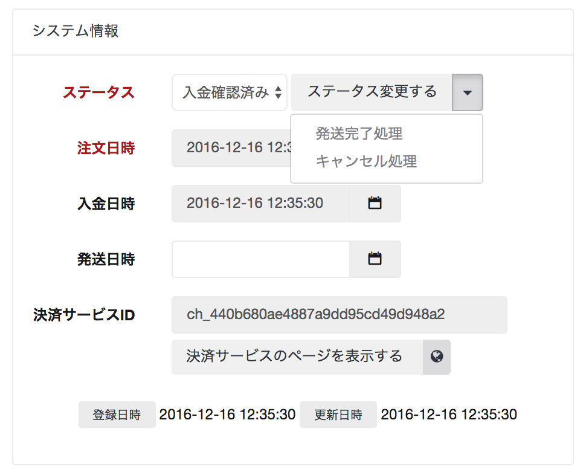
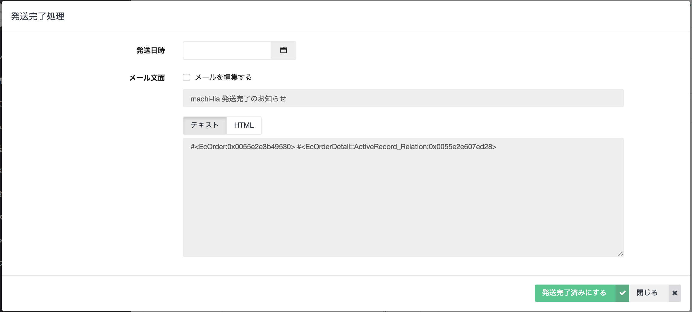

# ステータス変更

注文詳細画面から、注文のステータスを変更を行うことができます。

## ステータスの種類

| ステータス | 説明 |
| ------- | ---- |
| 受付 | サイトから注文を受けた際、支払方法がクレジットカードでない場合はこのステータスとなります |
| 入金確認済み | サイトから注文を受けた際、同時にクレジットカードで決済を行っている場合はこのステータスとなります。支払方法が現金や銀行振込の場合は、入金確認後にこのステータスに変更します |
| 発送準備中 | 発送準備入る場合はこのステータスに変更します。|
| 発送済み | 発送が完了したらこのステータスに変更します。 |
| キャンセル | 注文がキャンセルとなった場合はこのステータスに変更します。クレジットカード決済の場合は自動的に全額払い戻しとなります。 |

## 払い戻しについて

- 注文キャンセルによる払い戻し
  - [ステータス変更] からキャンセル処理を行ってください。
- 全額払い戻し
  - [払い戻す] ボタンより全額払い戻し
- 一部の金額を払い戻し
  - [払い戻す] ボタンより、金額を入力して払い戻し
  - PAY.JP 等、決済に利用しているサービス側で払い戻し処理を行う
