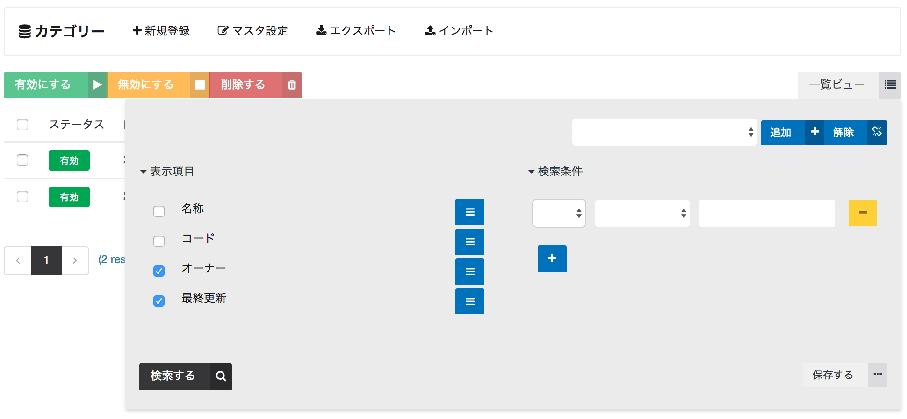
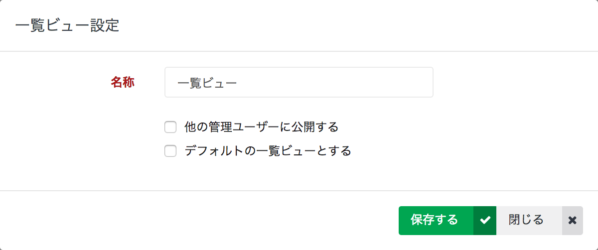

# 一覧ビュー

マスタデータ一覧画面では、ID・名前といったマスタ共通の項目のみが表示されます。

マスタ固有の項目を一覧に表示したり、検索条件を指定したい場合は一覧ビューを利用します。

保存時に `他の管理ユーザーに公開する` にチェックを付けると、他の管理ユーザーと一覧ビューを共有することができます。

また、`デフォルトの一覧ビューとする` にチェックを付けると、常に当該ビューが適用された状態で表示されます。

