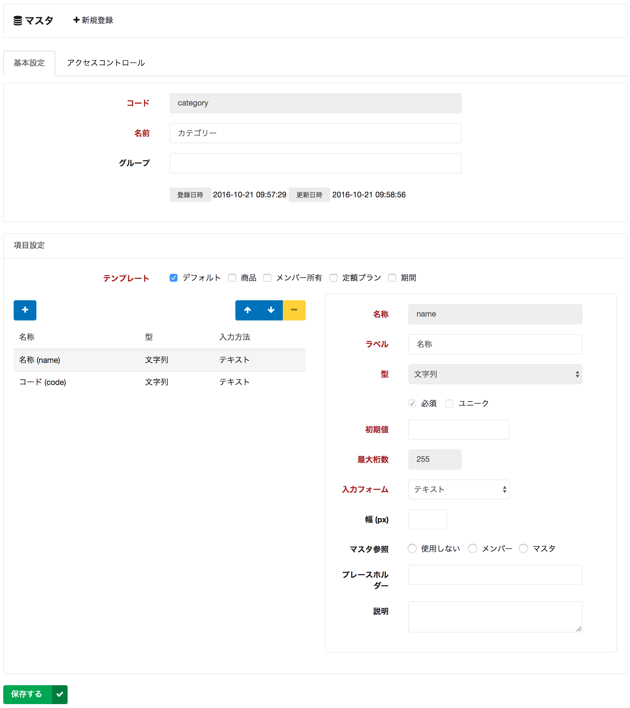

# マスタ詳細

マスタの詳細設定を行います。

## グループ

複数のマスタに対して同一のグループを指定すると、管理サイトの左ツリービューにてマスタをグルーピング表示できます。

## アクセスコントロール

サイト側から API 経由でマスタにアクセスする場合、アクセスコントロールを適切に設定する必要があります。
不用意にアクセスを許可してしまうと、マスタ情報がグローバルに公開されてしまう可能性があるため、考慮の上設定を行ってください。

## テンプレート

テンプレートにチェックを入れると、予め決められた項目が自動的に追加されます。

また、商品マスタ・定額プランマスタを定義する場合は、必ずそれぞれのテンプレートを設定する必要があります。

## 項目の型

マスタの各項目の型を選択します。
途中で型の変更を行っても、既に登録されたマスタデータについては適用されないのでご注意ください。

## 項目の入力フォーム

管理サイトからマスタデータを登録する際の、入力方法を定義します。

`自動採番` と `式` については、API 経由で登録した際にも適用されます。
