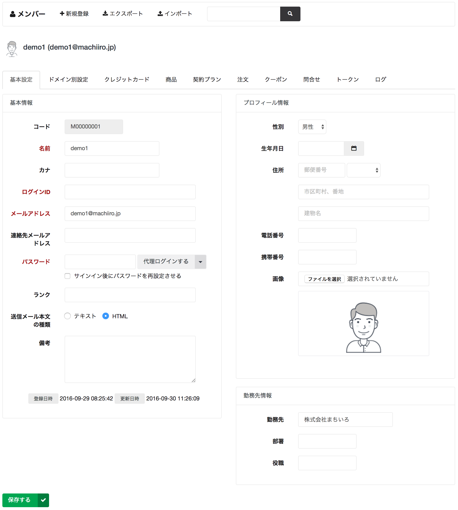

# 基本設定

メンバーの基本設定を行う画面です。
ここで設定される情報は全てのドメインで共通となります。

## ログイン ID とメールアドレス

メンバーの ID として、ログイン ID またはメールアドレスどちらかを必ず入力する必要があります。
machi-lia ではメールアドレスの利用を推奨していますが、メールアドレスが不要なサイトを構築する場合はログインIDを用いて認証することも可能です。

## ランク

メンバーの利用頻度・購入金額等に応じてランクを管理したい場合に利用します。

## 送信メール本文の種類

HTML を選択しており、かつメールテンプレートにて HTML 本文が設定されている場合、HTML メールが送信されます。

テキストが選択されている場合は、メールテンプレートに HTML 本文が設定されている場合でも、常にプレーンメールが送信されます。
