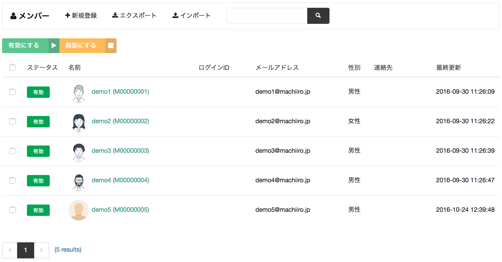

# メンバー検索

machi-lia インスタンスに登録されているメンバーを検索することができます。

## ステータスの種類

| ステータス | 説明 |
| -------- | ---- |
| 有効 | 有効なステータス |
| 無効 | 無効なステータス。サインインが不可となります。 |
| 仮登録 | サインアップ直後のステータス。確認メールの URL にアクセスするとステータスが有効となります。 |
| パスワードリセット | パスワードリセット直後のステータス。パスワード変更を行うとステータスが有効となります。 |
| 退会 | 退会ステータス。サインインが不可となります。 |
