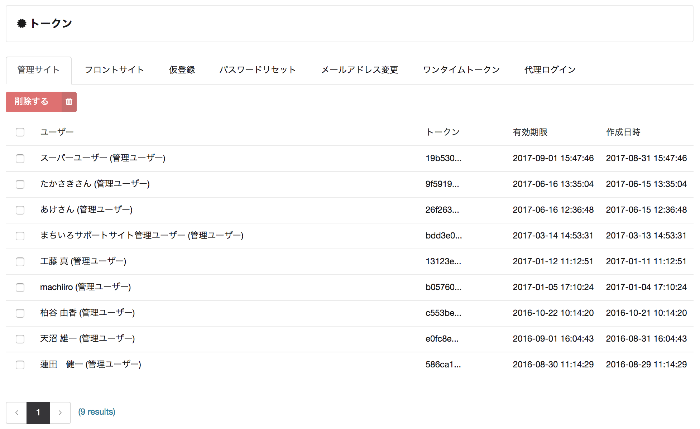

# トークン

トークンとは、machi-lia が発行する認証用の文字列のことです。この画面では発行済のトークンを確認したり、削除することができます。

## トークンの種類

| トークン | 説明 |
| ------- | ---- |
| 管理サイト        | 管理サイトにサインインを行った際に発行されるトークン |
| フロントサイト    | 開発したフロントサイトにサインインを行った際に発行されるトークン |
| 仮登録           | 開発したフロントサイトでメンバーの仮登録を行った際に発行されるトークン (確認メールの本文に記載される URL に付与される) |
| パスワードリセット | 開発したフロントサイトでパスワードリセットを行った際に発行されるトークン (確認メールの本文に記載される URL に付与される) |
| メールアドレス変更 | 開発したフロントサイトでメールアドレスの変更を行った際に発行されるトークン (確認メールの本文に記載される URL に付与される) |
| 代理ログイン      | 管理サイトから代理ログインを行った際に発行されるトークン |
